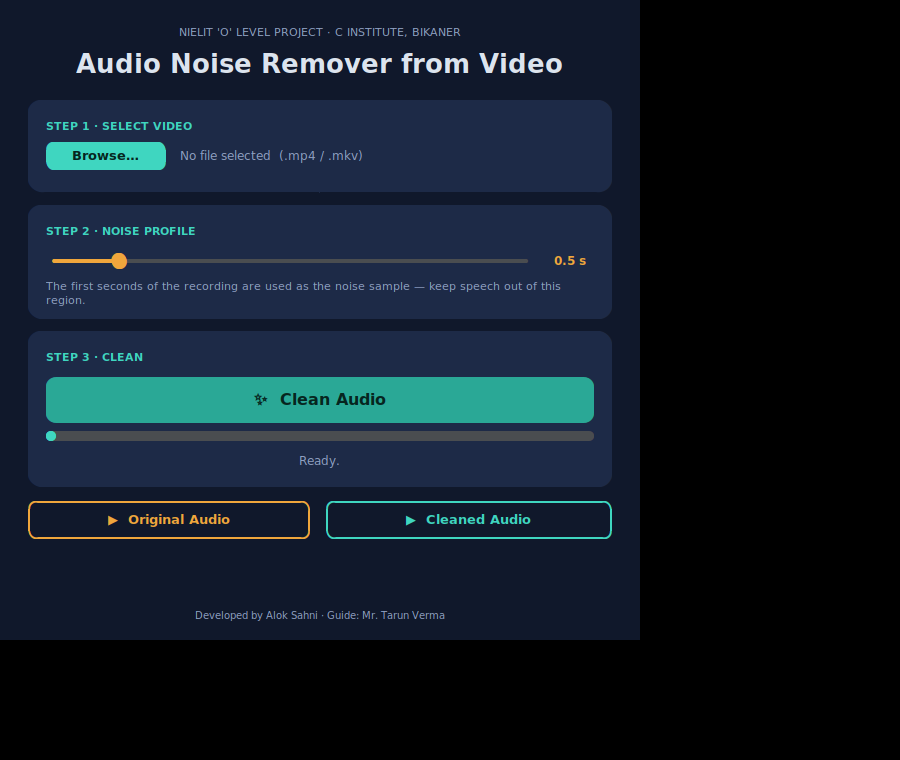

# Audio Noise Remover from Video 🎬🔊

A Python project that **extracts the audio from a video, removes background noise, and re-embeds the cleaned audio back into the video** — fully offline.

> Developed by **Alok Sahni** as the project for the **NIELIT 'O' Level Examination**, under the guidance of **Mr. Tarun Verma** (C Institute, Bikaner, Rajasthan).

The project is available in **three versions**, all sharing the same processing pipeline:

| Version | File | Interface |
| --- | --- | --- |
| 1. Desktop (original) | `audio_noise_remover.py` | Classic Tkinter window — as submitted in the project report |
| 2. Desktop (modern) | `audio_noise_remover_gui.py` | CustomTkinter dark UI with 3-step flow, slider, threading |
| 3. Web app | `app.py` + `templates/index.html` | Browser UI with drag-drop, waveform comparison, chunked processing for long videos |



## 🖥️ How It Works

```
Select video ──► FFmpeg/MoviePy extracts audio (WAV)
             ──► SciPy reads WAV, stereo → mono
             ──► First seconds taken as noise profile
             ──► noisereduce removes noise (spectral gating)
             ──► Cleaned 16-bit WAV saved
             ──► FFmpeg merges cleaned audio + original video
             ──► Output: <name>_cleaned.mp4
```

## 📋 Requirements

- Python 3.7+ · [FFmpeg](https://ffmpeg.org/download.html) installed (auto-detected on PATH, or `C:\ffmpeg\bin\ffmpeg.exe`)
- `pip install -r requirements.txt`

## 🚀 Usage

**Desktop (original):** `python audio_noise_remover.py`

**Desktop (modern UI):** `python audio_noise_remover_gui.py`

**Web app:** `python app.py` — your browser opens http://127.0.0.1:5000 automatically. Drop a video, click *Clean audio*, compare the amber (noisy) and teal (cleaned) waveforms, download the result. Long videos are processed in 30-second chunks so memory stays low.

**Jupyter/Colab:** open `Audio_Noise_Remover_Project_Alok_Sahni.ipynb` — includes a notebook-friendly pipeline with audio players and waveform plots.

## 📄 Documentation

- [Project Report (PDF)](Major_Project_Report_Audio_Noise_Remover_Alok_Sahni.pdf) — full NIELIT 'O' Level project report
- [Project Presentation (PPTX)](Audio_Noise_Remover_Presentation_REAL.pptx) — 21-slide presentation

## ⚠️ Known Limitations

- Noise profile is taken from the start of the recording (assumes it begins with noise only)
- Quality verified by listening comparison; no formal SNR metrics yet

## 👤 Author

**Alok Sahni** — NIELIT 'O' Level Candidate, C Institute, Bikaner, Rajasthan
Guide: Mr. Tarun Verma (A Level NIELIT, M.Sc. Computer Science, MGSU Bikaner)

## 📜 License

[MIT License](LICENSE)
